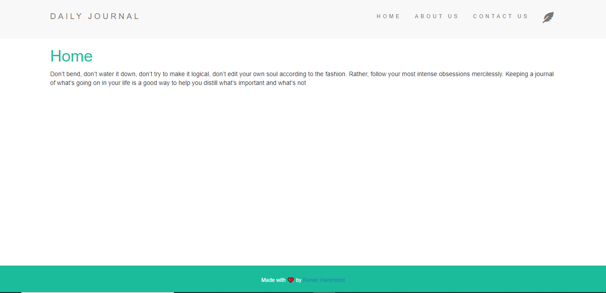

# Minimalist Blog

## Overview

A minimalist blog site using EJS, Node/Express.

## Installation 

Make sure you have `node` installed on your computer

1. Clone this repo
```bash
$ git clone https://github.com/RonenTGreat/Minimalist-blog.git
```

2. Navigate to `directory`
```bash
$ cd minimalist-blog
```


3. Install `dependencies`
```bash
$ npm i
```

1. Run app
```bash
$ node app.js
```

## How it looks
[](/preview/DailyJournal.mp4)